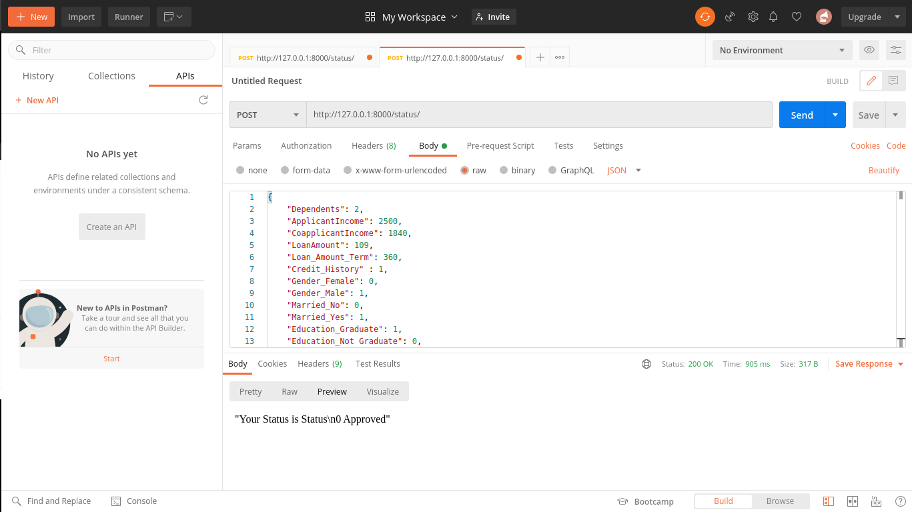

## Bankloan Approval Prediction

<!-- TABLE OF CONTENTS -->
<details open="open">
  <summary>Table of Contents</summary>
  <ol>
    <li>
      <a href="#about-the-project">About The Project</a>
      <ul>
        <li><a href="#built-with">Built With</a></li>
      </ul>
    </li>
    <li>
      <a href="#getting-started">Getting Started</a>
      <ul>
        <li><a href="#prerequisites">Prerequisites</a></li>
        <li><a href="#installation">Installation</a></li>
      </ul>
    </li>
    <li><a href="#usage">Usage</a></li>
  </ol>
</details>


<!-- ABOUT THE PROJECT -->
## About The Project


------
----
------
### Built With
- Tensorflow
- Django

<!-- GETTING STARTED -->
## Getting Started

Instructions setting up this project locally.
To get a local copy up and running follow these simple example steps.

### Prerequisites

 Software and IDE.
* Any python ide
  ```sh
  Pycharm/vscode and jupyter notebook for creating and saving model
  ```
* Postman software
  ```sh
  To send post request in json form
  ```

### Installation

1. Clone the repo
   ```sh
   git clone https://github.com/Shubhamraw/DjangoAPI.git
   ```
2. Install requirements.txt file
   ```sh
    using pip
    python3 -m venv env
    source env/bin/activate
    pip install -r requirements.txt
    
    using conda env
    conda create --name <env_name> --file requirements.txt
    
    using conda
    conda install --file requirements.txt
   ```
3. Run server
   ```sh
   python manage.py runserver
   ```
4. Install Postman
   '''sh
   Copy the json syntax from "postman post api check.txt" file and Post it to 127.0.0.1:8000/status/
   to get the prediction.
   '''
5. For admin dashboard
   '''sh
   Go to 127.0.0.1:8000/admin/
   username = shubham
   password = hello
   '''


<!-- USAGE EXAMPLES -->
## Usage
This is just a sample api build on basic neural network and an accuracy of about 81% got from 
small bankloan.csv dataset. So this sample can be upscale using huge dataset and adding more 
neurons to the neural network. This can be used to check the user application on certain criteria,
such as loan_amount, applicant_income, credit_history etc. The model already learned from the data so it can be able
to approve or reject the application applying for loan.


